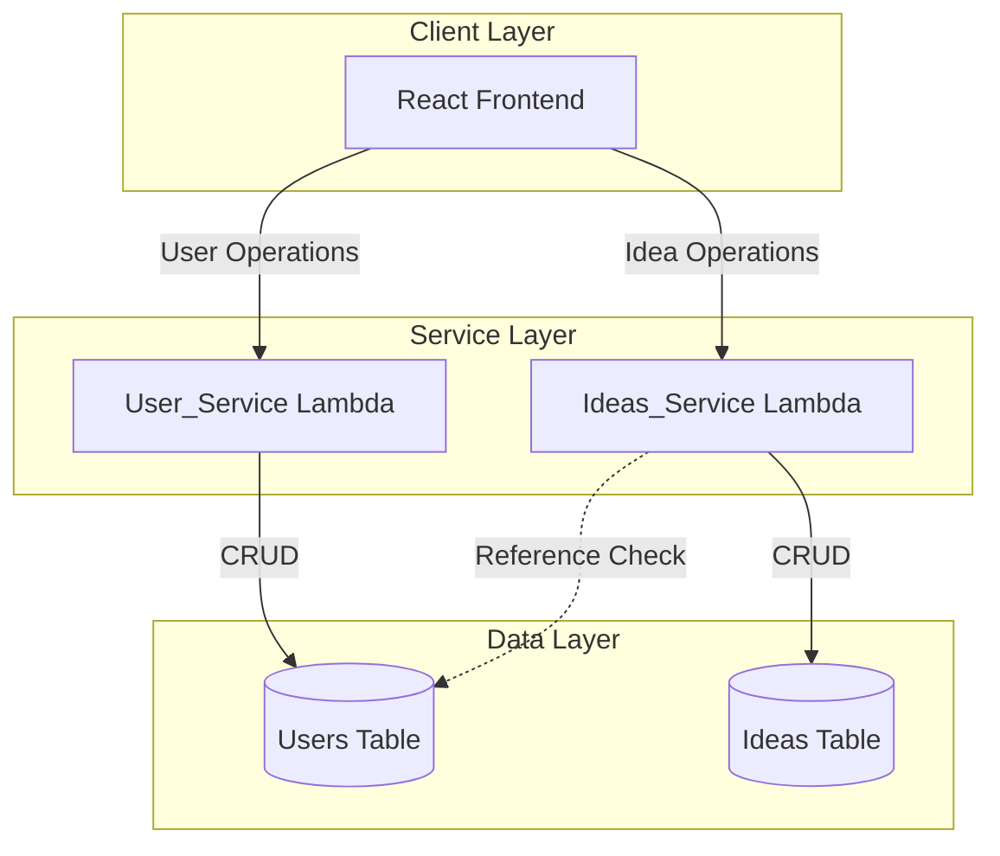
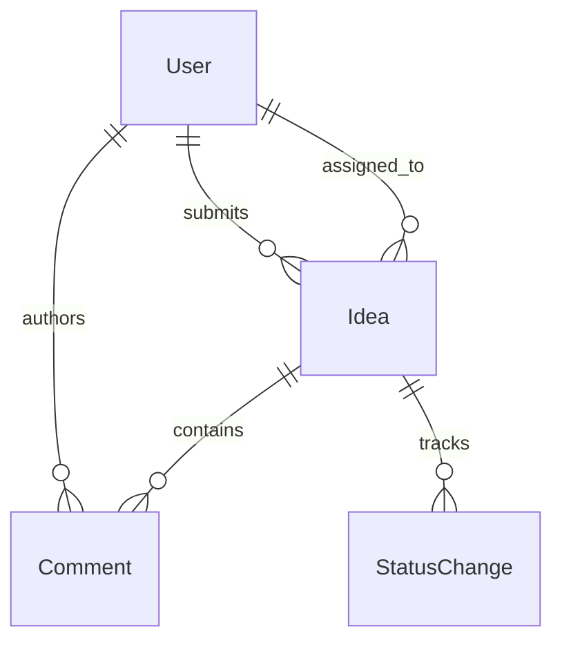

# Design Document: Employee Ideas Management System

## Overview

The Employee Ideas Management System is a serverless web application that enables employees to submit innovative ideas and facilitates their review, assignment, and implementation tracking. The system consists of a React frontend, two AWS Lambda functions (User_Service and Ideas_Service), and DynamoDB for data persistence.

The architecture follows a clear separation of concerns with dedicated services for user management and idea management. The system supports four distinct user roles (Employee, Reviewer, Implementer, Admin) with role-based access control enforced at the service layer.

Key capabilities include:
- User authentication and role-based authorization
- Idea submission with validation
- Idea review and assignment workflow
- Status tracking through the implementation lifecycle
- Comment threads for collaboration
- User management for administrators

## Architecture

### System Components



### Service Boundaries

**User_Service Lambda**
- Handles all user CRUD operations
- Manages authentication and session tokens
- Enforces role-based access control for user management operations
- Validates user data before persistence

**Ideas_Service Lambda**
- Handles all idea CRUD operations
- Manages idea lifecycle (submission, review, assignment, implementation)
- Handles comment operations
- Enforces role-based access control for idea operations
- Validates idea data and status transitions

### Technology Stack

- **Frontend**: React (JavaScript/TypeScript)
- **Backend**: AWS Lambda (Node.js or Python)
- **Database**: AWS DynamoDB
- **Authentication**: Session tokens (implementation details in Lambda functions)

## Components and Interfaces

### User_Service Lambda

**Responsibilities:**
- User authentication
- User CRUD operations
- Role management
- User listing and filtering

**API Endpoints:**

```typescript
// Authentication
POST /auth/login
Request: { username: string, password: string }
Response: { token: string, userId: string, role: string } | Error

// User Management (Admin only)
POST /users
Request: { username: string, email: string, password: string, role: string }
Response: { userId: string } | Error

GET /users
Query: { role?: string }
Response: { users: User[] } | Error

GET /users/{userId}
Response: { user: User } | Error

PUT /users/{userId}
Request: { email?: string, role?: string, password?: string }
Response: { success: boolean } | Error

DELETE /users/{userId}
Response: { success: boolean } | Error
```

**Authorization Rules:**
- Authentication endpoints: Public
- User creation: Admin only
- User listing (all): Admin only
- User listing (by role): Reviewer (for Implementers), Admin
- User update/delete: Admin only

### Ideas_Service Lambda

**Responsibilities:**
- Idea submission and validation
- Idea retrieval with role-based filtering
- Idea assignment and status management
- Comment management

**API Endpoints:**

```typescript
// Idea Operations
POST /ideas
Request: { title: string, description: string, submitterId: string }
Response: { ideaId: string } | Error

GET /ideas
Query: { userId: string, role: string }
Response: { ideas: Idea[] } | Error

GET /ideas/{ideaId}
Response: { idea: Idea } | Error

PUT /ideas/{ideaId}/assign
Request: { assigneeId: string, reviewerId: string }
Response: { success: boolean } | Error

PUT /ideas/{ideaId}/status
Request: { status: string, userId: string, role: string, reason?: string }
Response: { success: boolean } | Error

// Comment Operations
POST /ideas/{ideaId}/comments
Request: { userId: string, text: string }
Response: { commentId: string } | Error

GET /ideas/{ideaId}/comments
Response: { comments: Comment[] } | Error
```

**Authorization Rules:**
- Idea submission: Employee, Reviewer, Implementer, Admin
- Idea listing: Role-based filtering (see Requirement 3)
- Idea assignment: Reviewer, Admin
- Status updates: Implementer (own ideas), Admin (all ideas)
- Comments: Implementer (assigned ideas), Reviewer (all), Admin (all)

### Frontend Components

**Core Components:**

1. **LoginForm**: Handles user authentication
2. **IdeaSubmissionForm**: Allows employees to submit ideas
3. **IdeaList**: Displays ideas based on user role
4. **IdeaDetail**: Shows full idea information with comments
5. **StatusUpdateControl**: Allows implementers to update status
6. **AssignmentControl**: Allows reviewers to assign ideas
7. **UserManagement**: Admin interface for user CRUD operations
8. **CommentThread**: Displays and allows adding comments

**State Management:**
- User session (token, userId, role)
- Current idea list
- Selected idea details
- Form validation states
- Error messages

## Data Models

### User Table (DynamoDB)

**Table Name**: `Users`

**Primary Key**: `userId` (String, Partition Key)

**Attributes**:
```typescript
interface User {
  userId: string;           // UUID
  username: string;         // Unique
  email: string;
  passwordHash: string;     // Hashed password
  role: 'Employee' | 'Reviewer' | 'Implementer' | 'Admin';
  createdAt: string;        // ISO 8601 timestamp
  updatedAt: string;        // ISO 8601 timestamp
}
```

**Global Secondary Indexes**:
- `username-index`: Partition key on `username` for login lookups
- `role-index`: Partition key on `role` for role-based queries

### Ideas Table (DynamoDB)

**Table Name**: `Ideas`

**Primary Key**: `ideaId` (String, Partition Key)

**Attributes**:
```typescript
interface Idea {
  ideaId: string;           // UUID
  title: string;
  description: string;
  submitterId: string;      // References User.userId
  assigneeId?: string;      // References User.userId
  status: 'Pending Review' | 'In Review' | 'Assigned' | 'In Progress' | 'Completed' | 'Rejected';
  rejectionReason?: string;
  comments: Comment[];
  statusHistory: StatusChange[];
  createdAt: string;        // ISO 8601 timestamp
  updatedAt: string;        // ISO 8601 timestamp
}

interface Comment {
  commentId: string;        // UUID
  authorId: string;         // References User.userId
  text: string;
  createdAt: string;        // ISO 8601 timestamp
}

interface StatusChange {
  status: string;
  changedBy: string;        // References User.userId
  changedAt: string;        // ISO 8601 timestamp
}
```

**Global Secondary Indexes**:
- `submitter-index`: Partition key on `submitterId` for employee idea queries
- `assignee-index`: Partition key on `assigneeId` for implementer idea queries
- `status-index`: Partition key on `status` for reviewer queries

### Data Relationships




## Correctness Properties

*A property is a characteristic or behavior that should hold true across all valid executions of a system—essentially, a formal statement about what the system should do. Properties serve as the bridge between human-readable specifications and machine-verifiable correctness guarantees.*

### Property 1: Authentication Round-Trip

*For any* valid user credentials, authenticating with those credentials should return a session token that can be used to access protected features.

**Validates: Requirements 1.1**

### Property 2: Invalid Credentials Rejection

*For any* invalid credentials (wrong password, non-existent username, malformed input), authentication attempts should be rejected with an error message.

**Validates: Requirements 1.2**

### Property 3: Role-Based Authorization

*For any* user and protected feature, access should be granted if and only if the user's role has permission for that feature.

**Validates: Requirements 1.3**

### Property 4: Idea Submission Round-Trip

*For any* valid idea (with title and description), submitting the idea and then retrieving it should return an idea with the same title, description, submitter ID, and initial status "Pending Review".

**Validates: Requirements 2.1, 2.3, 2.4**

### Property 5: Unique Idea Identifiers

*For any* set of submitted ideas, all idea identifiers should be unique.

**Validates: Requirements 2.2**

### Property 6: Idea Validation

*For any* idea submission missing required fields (title or description), the submission should be rejected with a validation error.

**Validates: Requirements 2.5**

### Property 7: Role-Based Idea Filtering

*For any* user requesting ideas, the returned list should contain exactly the ideas that user is authorized to see based on their role: Employees see their own submissions, Reviewers see ideas pending review or in review, Implementers see their assigned ideas, and Admins see all ideas.

**Validates: Requirements 3.1, 3.2, 3.3, 3.4**

### Property 8: Idea Response Completeness

*For any* idea retrieved from the system, the response should include all required fields: title, description, status, submitter ID, assignee ID (if assigned), and timestamps.

**Validates: Requirements 3.5**

### Property 9: Idea Assignment Updates

*For any* idea assigned by a Reviewer to an Implementer, the idea's assignee field should be updated to the Implementer's ID and the status should be changed to "Assigned".

**Validates: Requirements 4.1, 4.2**

### Property 10: Assignment Referential Integrity

*For any* assignment attempt with a non-existent user ID, the operation should fail with an error.

**Validates: Requirements 4.3**

### Property 11: Reviewer Status Updates

*For any* idea, a Reviewer should be able to update its status to "Approved" or "Rejected".

**Validates: Requirements 4.4**

### Property 12: Rejection Reason Required

*For any* idea rejection by a Reviewer, a rejection reason must be provided or the operation should fail with a validation error.

**Validates: Requirements 4.5**

### Property 13: Status Update Persistence

*For any* valid status update by an authorized user, updating the status and then retrieving the idea should reflect the new status.

**Validates: Requirements 5.1**

### Property 14: Valid Status Values

*For any* status update, the status value must be one of: "Pending Review", "In Review", "Assigned", "In Progress", "Completed", "Rejected", or the operation should fail with a validation error.

**Validates: Requirements 5.2**

### Property 15: Implementer Authorization

*For any* Implementer attempting to update an idea not assigned to them, the operation should fail with an authorization error.

**Validates: Requirements 5.3**

### Property 16: Status Change Timestamps

*For any* status change, the system should record a timestamp with the change.

**Validates: Requirements 5.4**

### Property 17: Admin Status Update Privileges

*For any* idea and any status value, an Admin should be able to update the idea's status.

**Validates: Requirements 5.5**

### Property 18: Comment Persistence

*For any* valid comment added to an idea by an authorized user, adding the comment and then retrieving the idea should include that comment with the correct author ID and timestamp.

**Validates: Requirements 6.1, 6.2**

### Property 19: Comment Chronological Ordering

*For any* idea with multiple comments, retrieving the idea should return comments in chronological order (earliest to latest).

**Validates: Requirements 6.3, 6.5**

### Property 20: Comment Authorization

*For any* idea, Reviewers and Admins should be able to add comments, and Implementers should be able to add comments to ideas assigned to them.

**Validates: Requirements 6.4**

### Property 21: User Creation Round-Trip

*For any* valid user data (username, email, role), creating a user and then retrieving it should return a user with the same username, email, and role.

**Validates: Requirements 7.1**

### Property 22: Unique User Identifiers

*For any* set of created users, all user identifiers should be unique.

**Validates: Requirements 7.2**

### Property 23: Role Update Persistence

*For any* user, updating their role and then retrieving the user should reflect the new role.

**Validates: Requirements 7.3**

### Property 24: User Deletion

*For any* user, after deletion, attempting to retrieve that user should fail with a not-found error.

**Validates: Requirements 7.4**

### Property 25: Valid Role Values

*For any* user creation or update, the role must be one of: "Employee", "Reviewer", "Implementer", "Admin", or the operation should fail with a validation error.

**Validates: Requirements 7.5**

### Property 26: Username Uniqueness

*For any* existing user, attempting to create another user with the same username should fail with an error.

**Validates: Requirements 7.6**

### Property 27: Admin User Retrieval Completeness

*For any* set of users in the system, an Admin requesting all users should receive all of them.

**Validates: Requirements 8.1**

### Property 28: User Response Completeness

*For any* user retrieved from the system, the response should include all required fields: username, email, role, and user identifier.

**Validates: Requirements 8.2**

### Property 29: User Role Filtering

*For any* role filter applied by a Reviewer, the returned users should contain only users with that specific role.

**Validates: Requirements 8.3**

### Property 30: User Listing Authorization

*For any* non-Admin user attempting to list all users, the operation should fail with an authorization error.

**Validates: Requirements 8.4**

### Property 31: Frontend Error Display

*For any* error returned by backend services, the Frontend should display the error message to the user.

**Validates: Requirements 9.6, 11.5**

### Property 32: User Data Model Structure

*For any* user stored in DynamoDB, the user identifier should be used as the primary key.

**Validates: Requirements 10.1**

### Property 33: Idea Data Model Structure

*For any* idea stored in DynamoDB, the idea identifier should be used as the primary key.

**Validates: Requirements 10.2**

### Property 34: Write Confirmation

*For any* successful write operation to DynamoDB, the system should only return success to the client after confirming persistence.

**Validates: Requirements 10.3**

### Property 35: Database Error Handling

*For any* DynamoDB operation failure, the system should return an error response to the client.

**Validates: Requirements 10.4**

### Property 36: Referential Integrity

*For any* idea in the system, the submitter ID and assignee ID (if present) should reference existing users.

**Validates: Requirements 10.5**

### Property 37: Descriptive Error Messages

*For any* error condition (validation, authorization, or database failure), the system should return a descriptive error message indicating the type and nature of the error.

**Validates: Requirements 11.1, 11.2, 11.3**


## Error Handling

### Error Categories

**Validation Errors (400 Bad Request)**
- Missing required fields (title, description, username, email, etc.)
- Invalid field values (empty strings, invalid email format)
- Invalid status transitions
- Invalid role values
- Missing rejection reason when rejecting ideas

**Authorization Errors (403 Forbidden)**
- Non-Admin users attempting admin operations
- Implementers updating ideas not assigned to them
- Employees accessing other employees' ideas
- Unauthenticated access to protected resources

**Not Found Errors (404 Not Found)**
- Requesting non-existent users
- Requesting non-existent ideas
- Assigning ideas to non-existent users

**Conflict Errors (409 Conflict)**
- Creating users with duplicate usernames
- Referential integrity violations

**System Errors (500 Internal Server Error)**
- DynamoDB operation failures
- Lambda function errors
- Unexpected exceptions

### Error Response Format

All errors should follow a consistent format:

```typescript
interface ErrorResponse {
  error: {
    code: string;           // Error code (e.g., "VALIDATION_ERROR", "UNAUTHORIZED")
    message: string;        // Human-readable error message
    details?: any;          // Optional additional context
  }
}
```

### Error Handling Strategy

**Lambda Functions:**
- Wrap all operations in try-catch blocks
- Log errors with sufficient context for debugging
- Return appropriate HTTP status codes
- Never expose internal implementation details in error messages
- Validate all inputs before processing

**Frontend:**
- Display user-friendly error messages
- Provide actionable guidance when possible
- Log errors for debugging
- Handle network failures gracefully
- Show loading states during async operations

**DynamoDB:**
- Handle conditional check failures for uniqueness constraints
- Retry transient failures with exponential backoff
- Validate data before writes
- Use transactions for operations requiring atomicity

## Testing Strategy

### Overview

The testing strategy employs a dual approach combining unit tests for specific scenarios and property-based tests for comprehensive coverage of universal properties. This ensures both concrete correctness and general behavioral guarantees.

### Unit Testing

**Purpose:**
- Verify specific examples and edge cases
- Test integration points between components
- Validate error conditions with known inputs
- Test UI component rendering and interactions

**Scope:**

*User_Service Lambda:*
- Authentication with specific valid/invalid credentials
- User CRUD operations with known data
- Role-based access control with specific role combinations
- Username uniqueness constraint enforcement
- Password hashing and validation

*Ideas_Service Lambda:*
- Idea submission with specific valid/invalid data
- Status transitions through the complete lifecycle
- Assignment to specific users
- Comment addition and retrieval
- Role-based idea filtering with known datasets

*Frontend Components:*
- Component rendering for each role
- Form validation and submission
- Error message display
- Navigation and routing
- State management

**Example Unit Tests:**
```typescript
// User_Service
test('Admin can create user with valid data')
test('Creating user with duplicate username returns error')
test('Non-admin cannot delete users')

// Ideas_Service
test('Employee can submit idea with title and description')
test('Submitting idea without title returns validation error')
test('Reviewer can assign idea to implementer')
test('Implementer cannot update unassigned idea')

// Frontend
test('Login form displays for unauthenticated users')
test('Employee dashboard shows idea submission form')
test('Validation errors are displayed to user')
```

### Property-Based Testing

**Purpose:**
- Verify universal properties across all possible inputs
- Discover edge cases through randomization
- Ensure correctness guarantees hold generally
- Test invariants and round-trip properties

**Configuration:**
- Minimum 100 iterations per property test
- Use appropriate generators for each data type
- Each test references its design document property

**Property-Based Testing Library:**
- **JavaScript/TypeScript**: fast-check
- **Python**: Hypothesis

**Test Organization:**

Each correctness property from the design document should be implemented as a property-based test with the following tag format:

```typescript
// Feature: employee-ideas-management, Property 1: Authentication Round-Trip
test.prop([fc.record({
  username: fc.string({ minLength: 1 }),
  password: fc.string({ minLength: 8 })
})])('authenticated users can access protected features', async (credentials) => {
  // Test implementation
});
```

**Generators:**

*User Generator:*
```typescript
const userGen = fc.record({
  username: fc.string({ minLength: 1, maxLength: 50 }),
  email: fc.emailAddress(),
  password: fc.string({ minLength: 8 }),
  role: fc.constantFrom('Employee', 'Reviewer', 'Implementer', 'Admin')
});
```

*Idea Generator:*
```typescript
const ideaGen = fc.record({
  title: fc.string({ minLength: 1, maxLength: 200 }),
  description: fc.string({ minLength: 1, maxLength: 5000 }),
  submitterId: fc.uuid()
});
```

*Status Generator:*
```typescript
const statusGen = fc.constantFrom(
  'Pending Review',
  'In Review',
  'Assigned',
  'In Progress',
  'Completed',
  'Rejected'
);
```

**Key Property Tests:**

*Round-Trip Properties:*
- User creation and retrieval (Property 21)
- Idea submission and retrieval (Property 4)
- Status update and retrieval (Property 13)
- Role update and retrieval (Property 23)
- Comment addition and retrieval (Property 18)

*Invariant Properties:*
- Unique identifiers (Properties 5, 22)
- Initial idea status is "Pending Review" (Property 4)
- Status change timestamps recorded (Property 16)
- Comments in chronological order (Property 19)

*Authorization Properties:*
- Role-based access control (Property 3)
- Role-based idea filtering (Property 7)
- Implementer authorization (Property 15)
- User listing authorization (Property 30)

*Validation Properties:*
- Required field validation (Property 6)
- Valid status values (Property 14)
- Valid role values (Property 25)
- Username uniqueness (Property 26)
- Rejection reason required (Property 12)

*Error Handling Properties:*
- Invalid credentials rejection (Property 2)
- Referential integrity (Properties 10, 36)
- Database error handling (Property 35)
- Descriptive error messages (Property 37)

### Integration Testing

**Purpose:**
- Verify end-to-end workflows
- Test Lambda function integration with DynamoDB
- Test Frontend integration with Lambda functions
- Validate authentication flow

**Key Integration Tests:**
- Complete idea lifecycle: submission → review → assignment → implementation → completion
- User management workflow: creation → role update → deletion
- Authentication and authorization flow
- Comment thread on an idea
- Multi-user scenarios with concurrent operations

### Test Environment

**Local Development:**
- Use DynamoDB Local for database operations
- Mock AWS Lambda environment
- Use test fixtures for known data scenarios

**CI/CD Pipeline:**
- Run all unit tests on every commit
- Run property-based tests with 100+ iterations
- Run integration tests against test environment
- Enforce code coverage thresholds (minimum 80%)

### Test Data Management

**Generators for Property Tests:**
- Random but valid user data
- Random but valid idea data
- Random role assignments
- Random status transitions
- Edge cases: empty strings, very long strings, special characters

**Fixtures for Unit Tests:**
- Known user accounts with specific roles
- Sample ideas in various states
- Comment threads with multiple participants
- Error scenarios with specific invalid data

### Coverage Goals

- Unit test coverage: 80% minimum
- Property-based tests: All 37 correctness properties implemented
- Integration tests: All major workflows covered
- Error paths: All error categories tested

